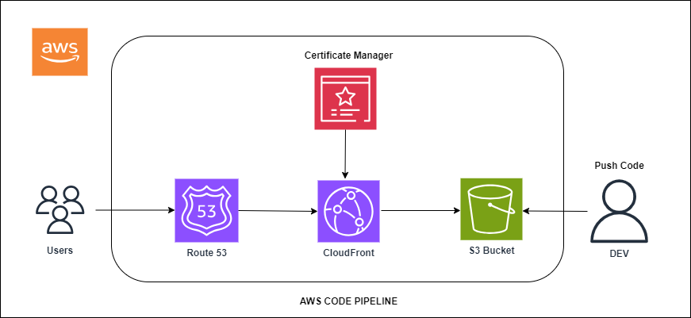
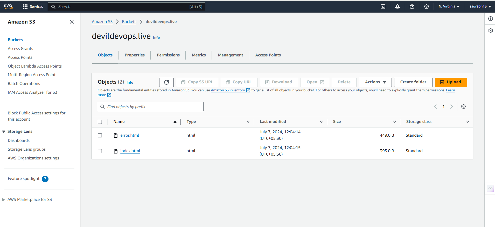
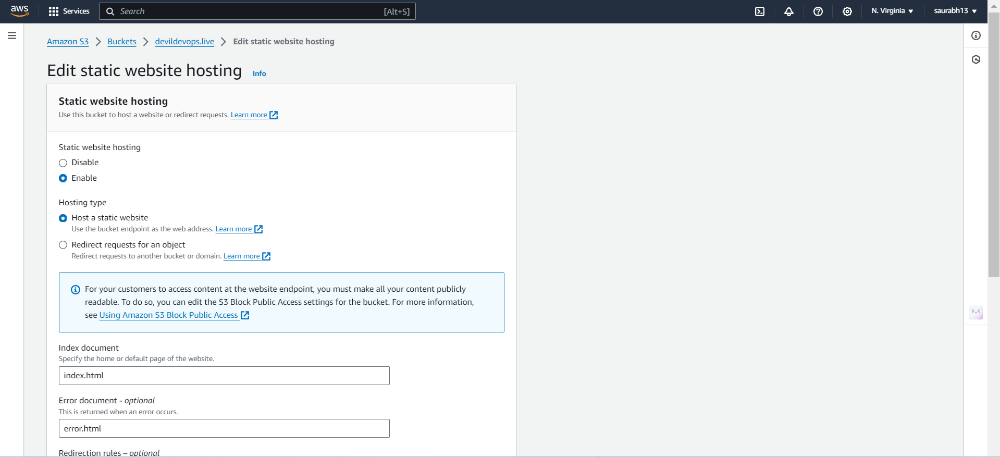
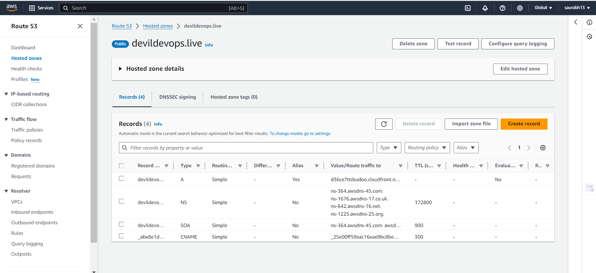
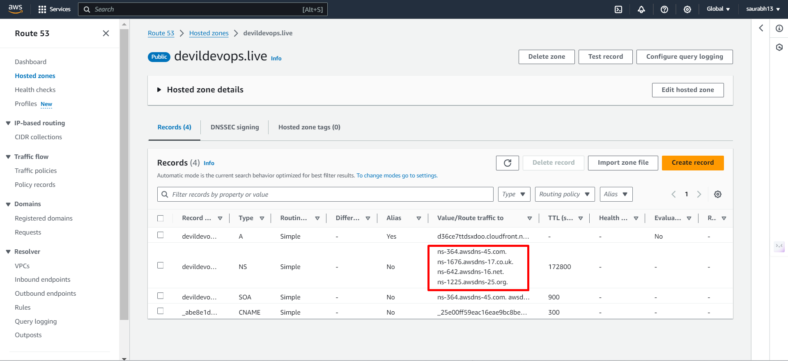
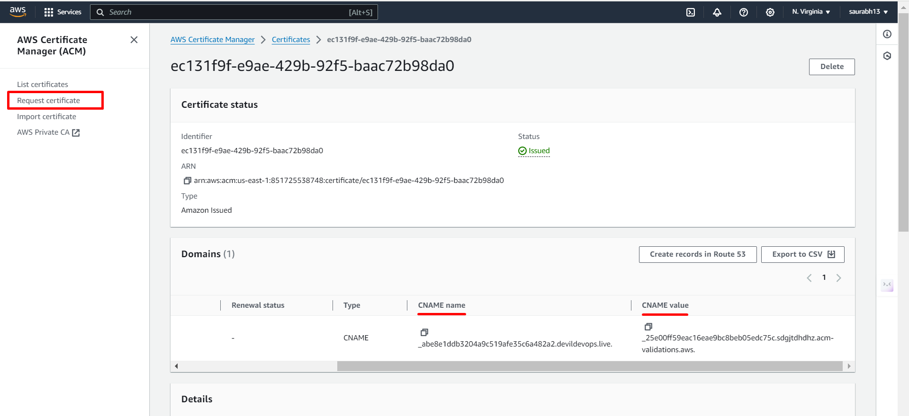

# Static Website Hosting on AWS Using S3, CloudFront, ACM, Route 53, and AWS CodePipeline

This project demonstrates the deployment of a static website on AWS, utilizing Amazon S3, CloudFront, ACM, Route 53, and AWS CodePipeline. By following a series of steps, you will create a scalable and secure static website hosting solution. The process includes setting up an S3 bucket for content storage, enabling static website hosting, configuring a custom domain with Route 53, securing the site with an ACM certificate, and distributing the content globally via CloudFront. Additionally, AWS CodePipeline is used to automate the deployment process, ensuring a seamless and efficient workflow. The architecture diagram and reference files can be found in the accompanying GitHub repository.

## Table of Contents

1. [Prerequisites](#prerequisites)
2. [Architecture](#architecture)
3. [Steps](#steps)
    1. [Create S3 Bucket](#create-s3-bucket)
    2. [Enable Static Website Hosting](#enable-static-website-hosting)
    3. [Create Route 53 Hosted Zone](#create-route-53-hosted-zone)
    4. [Update DNS Provider Nameservers](#update-dns-provider-nameservers)
    5. [Create ACM Certificate](#create-acm-certificate)
    6. [Create CloudFront Distribution](#create-cloudfront-distribution)
    7. [Create Route 53 Record](#create-route-53-record)
    8. [Create AWS CodePipeline](#create-aws-codepipeline)
4. [Conclusion](#conclusion)

## Prerequisites

- An AWS account
- Domain name registered
- Basic knowledge of AWS services

## Architecture

The architecture diagram and reference files for this project can be found in the [GitHub repository](https://github.com/saurabhshende13/Static-Website-Hosting-on-AWS-Using-S3-CloudFront-ACM-Route-53-and-AWS-CodePipeline.git).

## Steps

### 1. Create S3 Bucket

- Log in to the AWS Management Console.
- Navigate to the S3 service.
- Click on "Create bucket".
- Enter a unique bucket name and select the appropriate region.
- Click "Create bucket" and upload your `index.html` and `error.html` files to the bucket.

### 2. Enable Static Website Hosting

- Go to the properties tab of your S3 bucket.
- Scroll down to "Static website hosting".
- Select "Enable" and specify the `index.html` and `error.html` files.
- Save the changes.

### 3. Create Route 53 Hosted Zone

- Navigate to the Route 53 service in the AWS Management Console.
- Click on "Hosted zones" and then "Create hosted zone".
- Enter your domain name and click "Create hosted zone".

### 4. Update DNS Provider Nameservers

- Copy the nameservers provided by Route 53.
- Go to your domain registrar’s website and replace the existing nameservers with the ones provided by Route 53.

### 5. Create ACM Certificate

- Navigate to the ACM service in the AWS Management Console.
- Click on "Request a certificate".
- Enter your domain name and follow the steps to validate it.
- Add a CNAME record in your DNS provider’s records as part of the validation process.

### 6. Create CloudFront Distribution

- Go to the CloudFront service in the AWS Management Console.
- Click on "Create Distribution".
- Select "Web" and click "Get Started".
- Set the origin to your S3 bucket.
- Under the "Distribution Settings", add the ACM certificate created earlier.
- Complete the setup by clicking "Create Distribution".

### 7. Create Route 53 Record

- Return to the Route 53 hosted zone.
- Click on "Create Record Set".
- Set the alias target to your CloudFront distribution.
- Save the record set.

### 8. Create AWS CodePipeline

- Navigate to the CodePipeline service in the AWS Management Console.
- Click "Create pipeline".
- Name your pipeline and choose the source provider (e.g., GitHub).
- Connect to your repository and select the appropriate branch.
- Add build and deploy stages as needed to automate the process.

## Conclusion

By following these steps, you will have a fully automated pipeline that deploys a static website using AWS services. The GitHub repository contains the reference diagram and project files for further guidance.
